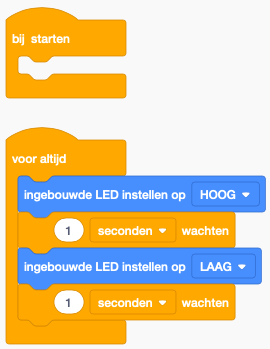

# Introductie

## Layout: Pins en leds

Een standaard arduino UNO bord ziet er als volgt uit

De zwarte vakjes zijn wat we **pins** noemen. Hier kan je draden aan verbinden die dan een elektrische kring kunnen maken. De pins zijn gegroepeerd in verschillende soorten: Power, Analog In en Digital. Van de aanduiding (~PWM) moeten we ons voorlopig niks aantrekken.

Naast de pins zijn er ook enkele LED lampjes (L, TX, RX, ON). ON zal altijd branden vanaf je op 'Simulatie starten' duwt. L is de interne LED van de arduino en kan je laten branden met een code-blok `ingebouwde LED instellen op HOOG``. TX en RX zijn voorlopig nog niet belangrijk.

## Code

Het speciale aan arduino is dat we kunnen programmeren wat er met de pins en leds gebeurd. Dit doen we met behulp van blokken die zeer gelijkaardig zijn aan hoe je Scratch programeert.  

Als je een nieuwe arduino toevoegt aan je project, zal deze automatisch reeds een klein stukje code bevatten. Dit stukje zorgt ervoor dat de interne LED (L) van de arduino zal knipperen vanaf we op 'simulatie starten' duwen.

* `Bij starten`: Alles wat in dit blokje zit wordt maar 1 keer uitgevoerd, op het moment dat de arduino opstart. Dit kan bijvoorbeeld handig zijn om een geluid signaal te laten horen vanaf het systeem aan staat.

* `Voor altijd`: Alles wat in dit blokje zit wordt oneindig vaak uitgevoerd. Als het laatste blokje is uitgevoerd, begin je dus terug met het eerste blokje. Dit gaat door tot de arduino uitgetrokken wordt.

* `ingebouwde LED instellen op HOOG`: Met deze blok kan je de ingebouwde LED HOOG of LAAG zetten. Hoog betekent dat de LED zal branden, LAAG betekend dat de led niet zal branden. 

* `1 seconden wachten`: Met deze blok kan je een variabel aantal seconden (of milliseconden) wachten. Zo kan je bijvoorbeeld een lamp voor 4 seconden laten branden door eerst de LED HOOG te zetten en vervolgens te wachten.

!!! note "Oefening 1: Opstart"
    Laat de led eerst 4 seconden branden voor dat hij begint te knipperen.