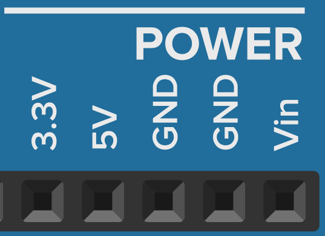

# Power

De pins van Power kan je gebruiken om bijvoorbeeld een sensor van stroom te voorzien.

{width="200"}

| Pin      | Beschrijving                         |
| ----------- | ------------------------------------ |
| `3.3V`       | + van 3.3V spanning. |
| `5V`       | + van 5V spanning. |
| `GND`    | gemeenschappelijke grond (universele - ). Zelfde als 0V.|
| `GND`    | gemeenschappelijke grond (universele - ). Zelfde als 0V.|
| `Vin`    | + van spanning gelijk aan voedings spanning (nog niet nodig).|

??? note "Oefening 1: Led branden"
    Gebruik de interne spanning van de arduino om een LED te laten branden.
    
    Opgave: Maak de juiste elektrische kring zodat je een let kan doen branden met de arduino Power pins.
    Let op! Anode moet aan de + pool, Kathode aan de - pool. Gebruik eventueel een weerstand indien nodig.

