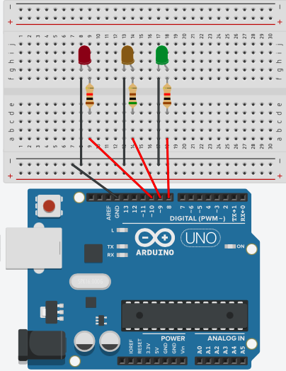

# Digitale output

In dit stuk ga je zien hoe je de digitale output kan gebruiken. Dit wil zeggen dat we de pin als 'output' gaan gebruiken.

| Pin      | Beschrijving                         | Input | Output |
| ----------- | ----------------------------------| ------ | ------ |
| `0... 13`       | Kan werken als digitale input of output.| Meet of er spanning (>2.5V) of geen spanning (<2.5V) is.| Kan 'HOOG' (+5V) of 'LAAG' (+0V) zijn.|
| `GND`    | gemeenschappelijke grond (universele - ). Zelfde als 0V. (zelfde als bij POWER)|

## Elektrische schakeling

Bij HOOG zal de pin +5V zijn, bij LAAG zal de pin 0V zijn. Om te zorgen dat er een stroom is als de pin HOOG staat, moeten we zorgen dat er een elektrische kring is. Dit wil zeggen dat we een + moeten hebben (de pin), en een - (de grond).

Je moet dus altijd zorgen dat er een gesloten kring is. 

Onderstaand voorbeeld laat zien hoe je de schakeling kan maken om een LED te laten branden met pin 9.

{width="100"}

!!! warning
    Let er op dat de maximale stroom die een digitale output kan leveren 40mA is. Dit is genoeg om 2 LED lampjes te laten branden, maar niet om bijvoorbeeld een motor te laten draaien. Om een grote verbruiker aan of uit te zetten zal je gebruik moeten maken van transistoren.

## Code

Om te programmeren wanneer de pin 'HOOG' of LAAG moet zijn, kan je gebruiken maken van het blokje `pin 0 instellen op HOOG`.

Onderstaande programma zal bijvoorbeeld:

* Pin 9 hoog zetten. Hierdoor stroomt er een stroom van pin 9 via de weerstand en de LED naar de grond.
* 1 seconde wachten. Pin 9 blijft dus hoog en de lamp blijft 1 seconde lang branden.
* pin 9 laag zetten. Hierdoor stroomt er geen stroom meer door de LED en zal deze uitgaan.
* 1 seconde wachten. Pin 9 blijft dus laag en de lampg brand 1 seconde niet.

Omdat alle 4 de stappen in een 'voor altijd' lus zitten, zal het resultaat een knipperende LED zijn.

??? note "Oefening 1: Verkeerslicht"
    Maak zelf een verkeerslicht. 
    
    Opgave: Laat eerst 4 seconden een rode led branden. Daarna 1 seconde een orange led. Tenslotte 4 seconden een groene LED. Zet alles in een lus zodat het verkeerslicht zich herhaalt (zoals een echt verkeerslicht).  

    Schakeling:  
    De weerstanden zijn elk 500 $\Omega$.  
    

??? note "Oefening 2: Morse"
    Laat een ledje branden dat SOS uitstuurt in Morse code. 
    
    Opgave: Voor SOS moet je eerste 3 keer kort knipperen (1 seconde aan, 1 seconde uit), vervolgens 3 seconden lang (3 seconden aan, 1 seconde uit) en tenslotte terug 3 keer kort. Maak zelf een schakeling.

    
