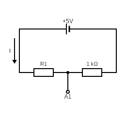
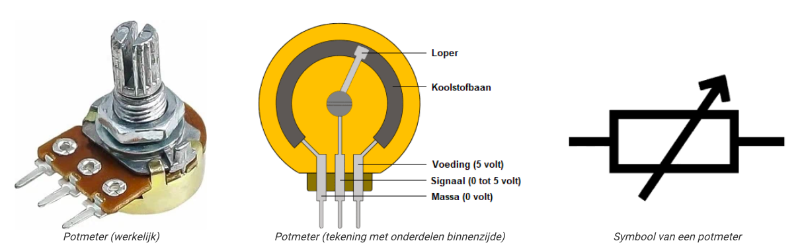
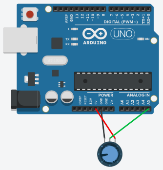
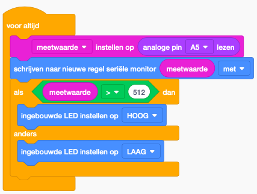
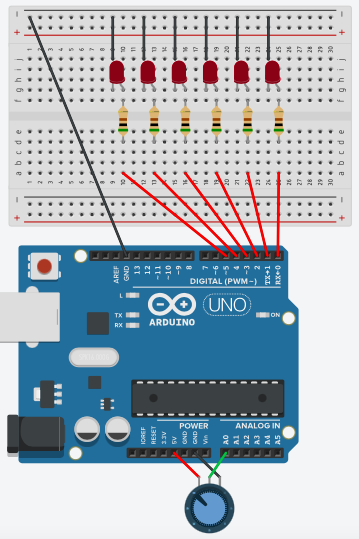

# Analog In

De analoge inputs laten je toe om de spanning te meten tussen 0V en 5V in stapjes van 0.005V.

{width="230"}

| Pin      | Beschrijving                         |
| ----------- | ------------------------------------ |
| `A0`       | Analoge input 0. Meet spanning in stapjes 0.005V van tussen 0V en 5V.|
| `A1`       | Analoge input 1. Meet spanning in stapjes 0.005V van tussen 0V en 5V.|
| `A2`       | Analoge input 2. Meet spanning in stapjes 0.005V van tussen 0V en 5V.|
| `A3`       | Analoge input 3. Meet spanning in stapjes 0.005V van tussen 0V en 5V.|
| `A4`       | Analoge input 4. Meet spanning in stapjes 0.005V van tussen 0V en 5V.|
| `A5`       | Analoge input 5. Meet spanning in stapjes 0.005V van tussen 0V en 5V.|

## Waarom?

Het kan handig zijn om de spanning te meten omdat we hieruit de weerstand kunnen bepalen. Neem bijvoorbeeld volgende kring

De spanning op punt A1 zal afhankelijk zijn van hoe groot de weerstand R1 is. De elektronen verliezen namelijk potentiele energie als ze door de weerstand gaan. Ze beginnen altijd met 5V maar na de weerstand hebbben ze bijvoorbeeld nog maar 4V. Na de tweede weerstand zullen ze altijd 0V hebben.

Het kunnen bepalen van hoe groot een weerstand is is interessant omdat er sensoren bestaan waarbij de weerstand afhankelijk is van de lichtintensiteit, de temperatuur, de druk, de positie of de kracht.

## Analoog naar digitaal

Het voltage A1 zal een analoog signaal zijn, namelijk een willeukrige spanning tussen 0 en 5V. Bijvoorbeel 3.34V zou de werkelijke spanning kunnen zijn. Om deze spanning echter om te zetten in computer code moet de arduino hier binair getal van maken. Aangezien de analoge input 10 bits gebruikt, zal de maximale waarde 1111 1111 of 1023 zijn. Een input van 5V zal dus waarde 1023 krijgen, een input van 0V een waarde 0. Alle waarden tussen 5V en 0V zullen lineair geinterpoleerd worden. Extra info tussen analoog en digitaal vind je in volgende video: https://youtu.be/zkhMy6piwt4?si=L8XUVbadMLv4TvXe.

## Variabele weerstanden

### Potentiometer

Onderstaande figuur geeft een potentiometer mee. Bij een potentiometer kan je op de 'Signaal' pin meten hoeveel van de oorspronkelijke spanning (aangebracht op 'Voeding') nog over is. Als de Loper helemaal naar rechts staat, zal alle spanning nog aanwezig zijn. Als de Loper helemaal links is zal alle spanning opgebruikt zijn en meten we 0 Volt (zelfde als Massa of Grond). Als de loper halverwege staat meten we 2.5V, aangezien de stroom reeds door een stuk weerstand van de Koolstofbaan moest. 

Afbeelding genomen van https://www.mvwautotechniek.nl/potentiometer/

!!! warning
    Onthoud, het Signaal zal door de Analog to Digital converter omgezet worden naar een getal tussen 0 (0V) en 1023 (5V).

### Lichtweerstand

### Temperatuur weerstand

## Code

Om te meten hoeveel spanning er op de analoge pin is, kan je gebruik maken van het blokje `analoge pin lezen`

Om te vermijden dat je meerdere keren deze waarde moet lezen, kan je 1x een variabele aanmaken (bvb meetwaarde, en deze variabele dan later elke keer opnieuw gebruiken). Ga hiervoor naar *Variabelen* en klik op *Variabele maken ...*.

Je kan nu de blok `Meetwaarde instellen op` om de meetwaarde eenmalig in te stellen op de analoge input. Vanaf dan kan je de variabele zelf gebruiken.

In volgend voorbeeld wordt geillustreed hoe je met deze functies:

1. De waarden van de potentiometer kan printen in de 'Seriële Monitor'
2. De interne LED kan aanzetten vanaf de potentiometer over halfweg zet.

=== "wiring"

    

=== "code"

    

??? note "Oefening 1: Volumeknop"
    Maak een volumeknop die meer lampjes doet branden naarmate je verder gaat.

    Schakeling:  
    De weerstanden zijn elk 500 $\Omega$.  
    

??? note "Oefening 2: Regelbaar maximum"

    Zorg voor een regelbaar maximum op de volumeknop. Herhaal oefening 1 maar voeg een tweede draaiknop toe waarop je een maximum kan instellen. Dit wil zeggen dat je als je de volumeknop voorbij het maximum draait, er geen extra lampjes gaan branden. 
    