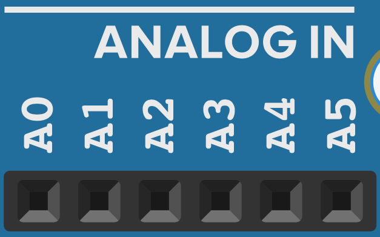

# Analog In

De analoge inputs laten je toe om de spanning te meten tussen 0V en 5V in stapjes van 0.005V.

{width="230"}

| Pin      | Beschrijving                         |
| ----------- | ------------------------------------ |
| `A0`       | Analoge input 0. Meet spanning in stapjes 0.005V van tussen 0V en 5V.|
| `A1`       | Analoge input 1. Meet spanning in stapjes 0.005V van tussen 0V en 5V.|
| `A2`       | Analoge input 2. Meet spanning in stapjes 0.005V van tussen 0V en 5V.|
| `A3`       | Analoge input 3. Meet spanning in stapjes 0.005V van tussen 0V en 5V.|
| `A4`       | Analoge input 4. Meet spanning in stapjes 0.005V van tussen 0V en 5V.|
| `A5`       | Analoge input 5. Meet spanning in stapjes 0.005V van tussen 0V en 5V.|
