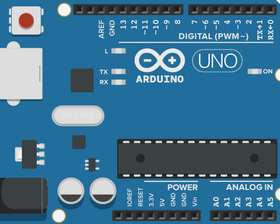
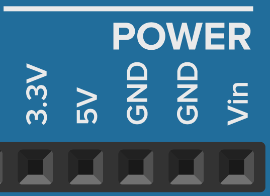

# Arduino layout

Een standaard arduino UNO bord ziet er als volgt uit

De zwarte vakjes zijn wat we **pins** noemen. Hier kan je draden aan verbinden die dan een elektrische kring kunnen maken. De pins zijn gegroepeerd in verschillende soorten: Power, Analog In en Digital. Van de aanduiding (~PWM) moeten we ons voorlopig niks aantrekken.

Zijn de pins zijn er ook enkele LED lampjes (L, TX, RX, ON). ON zal altijd branden vanaf je op 'Simulatie starten' duwt. L is de interne LED van de arduino en kan je laten branden met een code-blok 'ingebouwde LED instellen op HOOG'. code-blokken zullen we later bespreken. TX en RX zijn voorlopig nog niet belangrijk.

## Power

{width="200"}

| Pin      | Beschrijving                         |
| ----------- | ------------------------------------ |
| `3.3V`       | + van 3.3V spanning. |
| `5V`       | + van 5V spanning. |
| `GND`    | gemeenschappelijke grond (universele - ). Zelfde als 0V.|
| `GND`    | gemeenschappelijke grond (universele - ). Zelfde als 0V.|
| `Vin`    | + van spanning gelijk aan voedings spanning (nog niet nodig).|

## Analog In

{width="230"}

| Pin      | Beschrijving                         |
| ----------- | ------------------------------------ |
| `A0`       | Analoge input 0. Meet spanning in stapjes 0.005V van tussen 0V en 5V.|
| `A1`       | Analoge input 1. Meet spanning in stapjes 0.005V van tussen 0V en 5V.|
| `A2`       | Analoge input 2. Meet spanning in stapjes 0.005V van tussen 0V en 5V.|
| `A3`       | Analoge input 3. Meet spanning in stapjes 0.005V van tussen 0V en 5V.|
| `A4`       | Analoge input 4. Meet spanning in stapjes 0.005V van tussen 0V en 5V.|
| `A5`       | Analoge input 5. Meet spanning in stapjes 0.005V van tussen 0V en 5V.|

## Digital IO

| Pin      | Beschrijving                         | Input | Output |
| ----------- | ----------------------------------| ------ | ------ |
| `0... 13`       | Kan werken als digitale input of output.| Meet of er spanning (>2.5V) of geen spanning (<2.5V) is.| Kan 'HOOG' (+5V) of 'LAAG' (+0V) zijn.|
| `GND`    | gemeenschappelijke grond (universele - ). Zelfde als 0V. (zelfde als bij POWER)|

