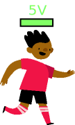
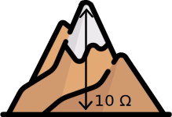
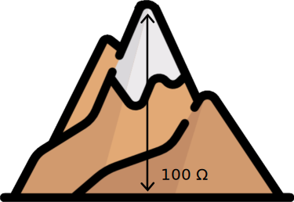

# 1. Elektrische kring

In dit stuk worden enkele basisbegrippen herhaald van een elektrische kring. Hierbij zijn vooral de woorden *stroom*, *potentiaal* en *weerstand* belangrijk.

We gaan deze woorden kort illusteren aan de hand van een loper die een loopwedstrijd loopt. 

<iframe src="https://scratch.mit.edu/projects/904614402/embed" allowtransparency="true" width="485" height="402" frameborder="0" scrolling="no" allowfullscreen></iframe>

## Stroom
De loper start altijd aan de start en eindigt aan de finish. Het parcour dat de loper aflegt noemen we de stroom. Hoe sneller de loper, hoe meer stroom. 

!!! note
    In elektriciteit spreken we af dat we de start de '+' noemen, en de finish de '-'. De stroom zal dus altijd van + naar - gaan.

## Potentiaal
Er zijn verschillende soorten lopers. Sommige lopers zijn goed getraind en starten met veel energie aan de finish. Andere lopers zijn minder goed getrained en starten met minder. We geven de potentiele energie weer in 'Volts'. Een loper met 5V energie zal dus minder snel een zelde ronde lopen als een loper met 9V.

{width="100"}
{width="100"}

Aan de finish zal elke loper volledig leeg gelopen zijn en geen energie meer over hebben. Het verschil is dat een goede loper sneller zal lopen dan een minder goede loper.
## Weerstand
Onderweg kunnen er hindernissen zijn zoals een bergje waar de loper over moet. Dit noemen we de weerstand. Een loper die over een hoge berg moet gaat natuurlijk minder snel lopen dan een loper die lage berg moet. Een grote weerstand zorgt dus voor een kleine stroom.

In de wereld van elektriciteit duiden we de hoogte van de weerstand in Ohm ($\Omega$). De stroom door een weerstand van 100 $\Omega$ is dus kleiner dan die door 10 $\Omega$.

