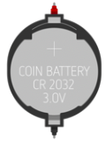
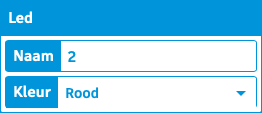
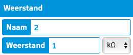

# 2. Elektrische schakeling

In dit hoofdstuk ga je leren hoe je een LED lamp laat branden in Tinkercad.

Er zijn 3 elementen die je nodig hebt om een lamp te laten branden.

1. Een batterij
2. Een led lamp
3. Een weerstand

## Batterij

Je hebt verschillende soorten batterijen, die elk een ander voltage leveren. Je zou kunnen zeggen dat deze batterijen lopers afleveren die ofwel zeer sportief zijn (9V), of juist niet zo sportief (1.5V). 

Let er op dat de batterijen altijd een + en een - pool hebben. De stroom loopt altijd volgens een gesloten circuit van + naar -. Je moet dus zowel een start als finish hebben!

## Led

Een led is een speciaal element. Het geeft ligt maar alleen als de stroom er op de juiste manier doorstroomt. De stroom moet altijd van de anode naar de kathode gaan! Klik op de beendjes van de LED om te zien wat de anode en de kathode is.

Hoe meer stroom er door de LED stroomt, hoe feller de LED zal branden. Maar let op! Als er te veel stroom door de LED gaat, zal deze doorbranden!

??? info
    Je kan de kleur van de led veranderen door er op te klikken en dan een andere kleur te selecteren.
    

## Weerstand

Om te zorgen dat de stroom door de LED niet te hoog is, kunnen we een weerstand toevoegen aan onze kring. 

??? info
    Je kan de grootte van de weertand (in $\Omega$) aanpassen door er op te klikken.
    

!!! example

    Probeer nu zelf! Laat een LED lamp branden met behulp van de 9V batterij. 
    
    * Wat is de ideale weerstand zodat je veel licht hebt maar de lamp niet doorbrandt?
    * Kan je de kleur van de led veranderen? 
    * Ken je meerdere LED's laten branden met 1 batterij?