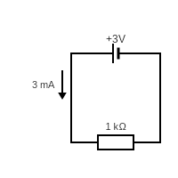
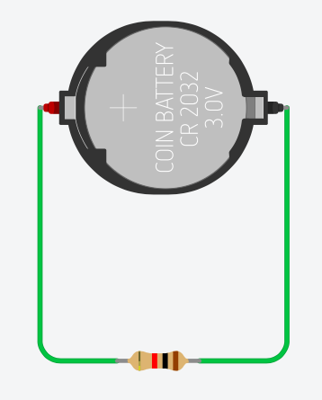
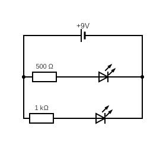

# Elektrische kring symbolen

We kunnen een elektrische kring ook voorstellen met symbolen. Hieronder is het schema gegeven voor een schakeling met een batterij en een weerstand. De stroom door deze schakeling zal 3mA zijn.

{width="200"}
{width="150"}

!!! warning
    De stroom gaat altijd van + naar -. Bij een batterij is + het grote streepje en - het kleine dikke streepje.

# Symbolen

Op [deze website](https://daltonmavo.nl/apps/componenten/index.html) vind je een lijst met alle sybmolen. Zoek zelf of de symbolen voor een batterij, een LED en weerstand terugvind.

??? note "Oefening met twee LED's"
    Maak volgende schakeling in TinkerCad. Zie je een verschil tussen de twee LEDs?
    